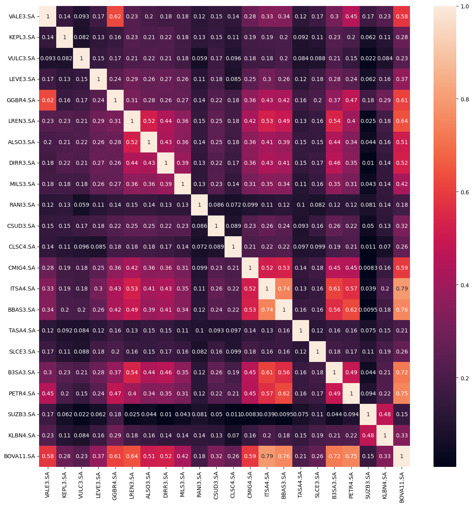

# stonks_analytics_analysis_ML

## Índice

- [Introdução](#introdução)
- [Observação](#observação)
- [Requisitos](#requisitos)
- [Instalação](#instalação)
- [Gráficos](#gráficos)


## Introdução
Neste projeto, embarquei em uma jornada empolgante de otimização de carteira financeira, explorando diversas técnicas avançadas para maximizar o desempenho e a eficiência no mundo dos investimentos.

Utilizando métodos como CAPM, séries temporais, previsão de Monte Carlo e algoritmos de Machine Learning, meu objetivo central foi construir uma carteira eficiente. A ênfase recaiu sobre a alocação ideal de ativos, ponderando pesos relativos com base no Sharp Ratio e alocando a proporção adequada do capital total para cada empresa.

Para dar vida a essa visão, empreguei um conjunto robusto de bibliotecas, incluindo pandas, numpy, yfinance, plotly, seaborn e scikit-learn. Essas ferramentas permitiram a análise detalhada de dados históricos e a implementação de técnicas avançadas de Machine Learning.

Ao longo do projeto, explorei algoritmos genéticos, otimização por subida de encosta (hill climb) e simulated annealing, utilizando inteligência artificial para ajustar dinamicamente a carteira ao longo do tempo.

O objetivo final é desenvolver uma estratégia de investimento inteligente e automatizada, capaz de se adaptar às mudanças do mercado e otimizar os retornos financeiros.

## Observação


O sharp ratio é uma medida de desempenho de investimento que mede a relação entre o retorno de um investimento e o risco associado a ele. É calculado como a razão entre o excesso de retorno do investimento sobre o retorno livre de risco e a volatilidade do investimento.

A fórmula do sharp ratio é a seguinte:

Sharp Ratio = (Retorno do Investimento - Retorno Livre de Risco) / Volatilidade do Investimento
Onde:

Retorno do Investimento é o retorno do investimento, após o ajuste da inflação.
Retorno Livre de Risco é o retorno de um investimento sem risco, como um título do governo.
Volatilidade do Investimento é a medida da variação do retorno do investimento.
Um sharp ratio positivo indica que o investimento teve um retorno superior ao retorno livre de risco, ajustado pelo risco. Um sharp ratio maior indica que o investimento teve um retorno superior ao retorno livre de risco, ajustado pelo risco, de forma mais significativa.

No arquivo fitness.py podemos observar que o Sharp Ratio é calculado de uma forma um pouco diferente. Tenho dados de todas as empresas desde 2012. Com isso, pude escolher atribuir pesos com referência a quão mais próximos os dados estão do presente. Os pesos em ordem a partir de 2012 são [1, 1, 1, 1, 1, 1, 2, 2, 3, 3, 4, 5]. Portanto, o Sharp Ratio dos últimos 4 anos é mais importante que o Sharp Ratio de 10 anos atrás. Para gerar os pesos para cada empresa, é preciso inicializar o arquivo.ipynb correspondente ao método de ML utilizado.

## Requisitos

Para instalar as bibliotecas utilizadas no projeto, você precisará de:

Um computador com sistema operacional Windows, macOS ou Linux.
Python versão 3.8 ou superior.
O gerenciador de pacotes pip.
Instalação do Python

Para instalar o Python, você pode seguir as instruções no site oficial da linguagem: https://www.python.org/downloads/


## Instalação

O projeto utiliza diversas bibliotecas para a realização das análises e previsões. Abaixo está uma lista das principais bibliotecas utilizadas e uma breve descrição de cada uma:

pandas: Pandas é uma biblioteca Python para análise e manipulação de dados. É usada extensivamente no projeto para importar, limpar, organizar e transformar os dados financeiros.

numpy: NumPy é uma biblioteca Python para computação científica. É usada no projeto para realizar cálculos matemáticos, como médias, desvios padrão e correlações.

pandas_datareader: Pandas DataReader é uma biblioteca Python para obter dados financeiros de fontes como Yahoo Finance e Google Finance. É usada no projeto para obter os dados históricos de preços de ativos financeiros.

matplotlib.pyplot: Matplotlib é uma biblioteca Python para criação de gráficos. É usada no projeto para criar gráficos de linhas, barras e dispersão.

seaborn: Seaborn é uma biblioteca Python para visualização de dados. É usada no projeto para criar gráficos mais complexos e visualmente atraentes.

plotly.express: Plotly Express é uma biblioteca Python para criação de gráficos interativos. É usada no projeto para criar gráficos interativos e dinâmicos.

yfinance: Yfinance é uma biblioteca Python para interagir com a API do Yahoo Finance. É usada no projeto para obter dados financeiros em tempo real e históricos.

scipy.stats: Scipy Stats é uma biblioteca Python para estatística computacional. É usada no projeto para realizar testes estatísticos, como testes de normalidade.

mlrose: Mlrose é uma biblioteca Python para otimização de problemas combinatórios. É usada no projeto para otimizar a alocação de ativos em carteiras de investimento.

Instalação das Bibliotecas
As bibliotecas utilizadas no projeto podem ser instaladas usando o gerenciador de pacotes pip. Para instalar todas as bibliotecas de uma vez, execute o seguinte comando no terminal:

```bash
pip install pandas numpy pandas-datareader matplotlib.pyplot seaborn plotly.express yfinance scipy stats mlrose
```

Após instalar as bibliotecas, você pode importar e utilizar elas em seu código Python.

## Gráficos
Utilizando HeatMap da biblioteca seaborn obtive os seguintes gráficos de correlação: 

Gráfico de Correlação Empresas:



Gráfico de Correlação Indicadores:


